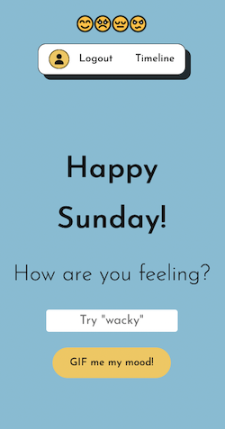

# Moody Memes 2.0: Track your Mood in Memes over Time! 

<a href="https://moody-memes.vercel.app/">🔗Live Link</a>

# About

<a href="https://moody-memes.vercel.app/"> Moody Memes 2.0</a> is a React application that allows authenticated users to track their mood in memes over time, by allowing users to type in their mood of the day, choose a meme/gif that best represents their mood, and save their 'Moody Meme' to the timeline. Users can sign-up for an account using an email address and password, via Google Sign-In, or as an anonymous user.

This project is a solo extension to <a href="https://moodymemes.netlify.app/">Moody Memes</a> (<a href="https://github.com/giphySentiment/moodyMemes">Repo</a>), a team-based React project completed at <a href="https://junocollege.com">Juno College</a>, with <a href="https://github.com/BrittFreitas">Brittany Freitas</a>, <a href="https://github.com/dbutch25">Daniel Butcher</a> and <a href="https://github.com/kwametsunami">Kwame Appiah-Kubi</a>.
 

# Features

Moody Memes 2.0 features:

- CRUD (Create, Read, Update, Delete) functionalities for saved memes
- User authentication with Firebase
- Session persistence (user remains logged within the same session)
- Anonymous user Sign-In
- Timeline features saved memes by users
- Users can only delete memes that they generated
- Usage of React features and hooks (useState, useEffect, useContext, useNavigate, useRef, Link, Router, props, components, custom hook)
- Firebase (User Authentication, Realtime Database)

# Project Demonstration

# Views

Tablet View (with user logged in)

Mobile View (with user logged in)

Mobile View (on hover of user icon)

✨Moody Memes 2.0 is graciously powered by the <a href="https://developers.giphy.com/docs/api/">Giphy API</a>.

